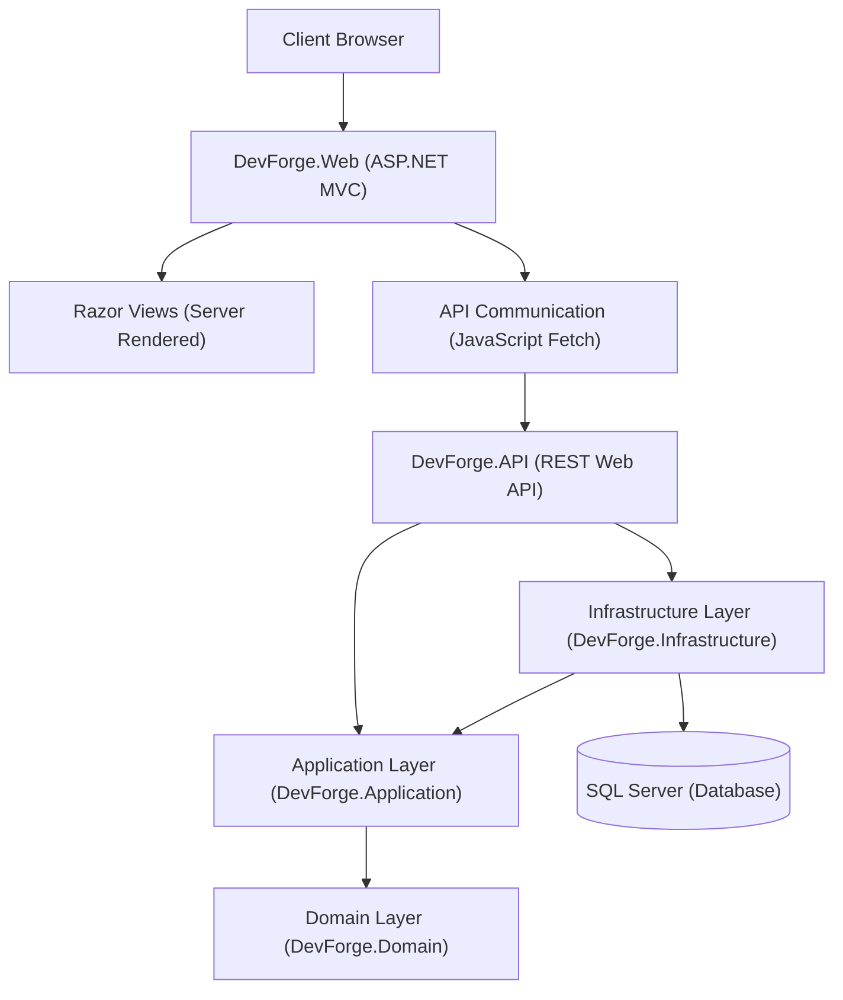

# DevForge Architecture Documentation

This document explains the structural layout, layers, and dependency design principles governing the **DevForge** application.

---

## Architectural Layout

DevForge uses **ASP.NET Core MVC** for the primary server-rendered web experience while maintaining a separate **REST API** for reusable backend capabilities.

This hybrid architecture provides distinct separation between view rendering and backend logic flow:

---

## Architectural Principles

DevForge separates page-serving concerns from raw data and business processing:
1. **Server-Rendered Pages**: Server composition via Razor Views delivers fast initial loads and simple server-side state tracking.
2. **Interactive JavaScript Features**: Dynamic UI tasks (like the connection status logs check) execute async Fetch calls to keep page states interactive without triggering full reloads.
3. **Reusable APIs**: Maintaining `DevForge.API` separately from MVC controllers guarantees that core platform services remain reusable for other clients in the future.
4. **Clean Separation**: MVC controllers remain thin, serving Views or processing simple ViewModel conversions. Business rules reside strictly inside the Application and Domain layers.
5. **Decoupled Architecture**: The API is CORS-enabled and decouples business logic, facilitating future SPA integrations if required.

---

## Layer Responsibilities

### 1. Domain Layer (`DevForge.Domain`)
* **Independence**: Sits at the center of the architecture, containing zero dependencies on databases, UI frameworks, or REST APIs.
* **Responsibilities**:
  * Core entity structures (e.g. `Entity`, `AuditableEntity`, `SystemStatusInfo`).
  * Basic entity model configs and base properties.

### 2. Application Layer (`DevForge.Application`)
* **Independence**: Depends only on the Domain layer.
* **Responsibilities**:
  * Application interfaces, business logic components, and dependency injection setup.

### 3. Infrastructure Layer (`DevForge.Infrastructure`)
* **Independence**: Implements Application contracts and references the Domain.
* **Responsibilities**:
  * Database access configuration (`ApplicationDbContext`) using Entity Framework Core.
  * SQL Server schemas configurations and automated SQLite in-memory mappings.
  * SQL Server connectivity health checks.

### 4. API Layer (`DevForge.API`)
* **Responsibilities**:
  * Exposes reusable REST endpoints (e.g., `SystemController` status checks).
  * Global exception diagnostic handlers (`GlobalExceptionHandler`) yielding unified ProblemDetails JSON payloads.
  * CORS permissions and Swagger UI specifications.
  * Structured Serilog logging.

### 5. Web Layer (`DevForge.Web`)
* **Responsibilities**:
  * Serves the HTML5 structure, custom CSS variables stylesheets (`site.css`), and modular JavaScript files (`api.js`, `site.js`).
  * Contains the main Razor Views (`_Layout.cshtml`, `Index.cshtml`).
  * Invokes the API asynchronously using Fetch.
