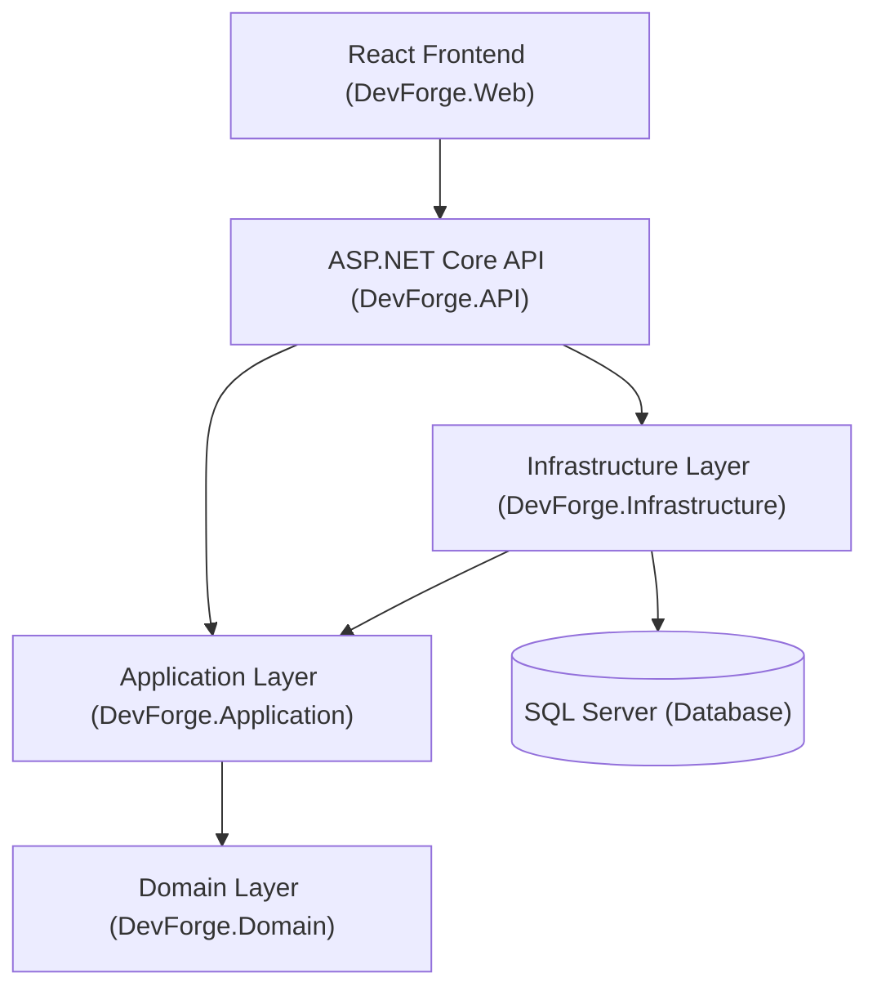

# DevForge Architecture Documentation

This document explains the structural layout, layers, and dependency design principles governing the **DevForge** application.

---

## Architectural Layout

DevForge is built using a pragmatic approach to **Clean Architecture**. This separates the domain entities, application-level use cases, infrastructure adapters, and presentation layers into distinct projects to maximize maintainability, testability, and framework independence.

---

## Layer Responsibilities

### 1. Domain Layer (`DevForge.Domain`)
* **Independence**: The Domain layer sits at the center of the architecture. It is completely independent of other projects, databases, frameworks, or external libraries.
* **Responsibilities**:
  * Core domain entities (e.g., `Entity`, `AuditableEntity`, `SystemStatusInfo`).
  * Domain exceptions and business rules.
  * Domain events.
  * System constants.

### 2. Application Layer (`DevForge.Application`)
* **Independence**: Depends only on the Domain layer. It is independent of UI, database, or external network adapters.
* **Responsibilities**:
  * Application-level models and unified results (`Result`, `Result<TValue>`, `Error`).
  * Core exceptions (e.g., `ValidationException`).
  * FluentValidation validators.
  * Dependency injection definitions for application-level behaviors.

### 3. Infrastructure Layer (`DevForge.Infrastructure`)
* **Independence**: Depends on the Application and Domain layers. It acts as an adapter connecting core abstractions to databases or outer networks.
* **Responsibilities**:
  * Entity Framework Core database contexts (`ApplicationDbContext`).
  * Database configuration schemes and migrations.
  * Entity mappings using Fluent API.
  * Database connectivity health check registrations.

### 4. Presentation Layer (`DevForge.API`)
* **Independence**: Sits on the outer edge, acting as the entry point. It depends on Application and Infrastructure layers.
* **Responsibilities**:
  * REST API controllers (e.g., `SystemController`, `ApiControllerBase`).
  * Global diagnostics, trace correlations, and custom ProblemDetails exception mappings (`GlobalExceptionHandler`).
  * OpenAPI/Swagger specifications, versioning metadata (`ConfigureSwaggerOptions`), and CORS layer filtering.
  * Structured bootstrap and request logs using Serilog.

### 5. Web Frontend (`DevForge.Web`)
* **Responsibilities**:
  * React SPA built with Vite, TypeScript, and Tailwind CSS (v4).
  * Consumes REST API endpoints version-by-version.
  * Provides responsive dashboard layouts, loading templates, and API connection status terminals.

---

## Dependency Rule

The dependency flow follows the core clean architecture guideline: **All source code dependencies point inward**.
* The **Domain** layer has no external dependencies.
* The **Application** layer depends only on the **Domain** layer.
* The **Infrastructure** and **Presentation (API)** layers depend on **Application** and **Domain**.
* External services (like **SQL Server** or **Redis**) are accessed through adapters defined in the **Infrastructure** layer.
* The **Web UI** only has network dependencies on the **API**.
